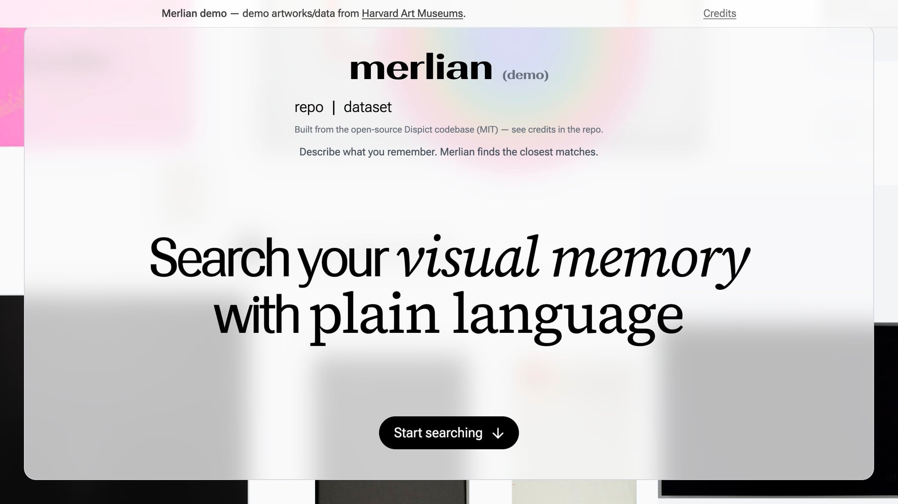

# Merlian

A **local-first visual memory search** tool: describe what you remember, retrieve the right image.

This repo contains a **shareable demo** built by reframing the open-source Dispict project into a utilitarian “Spotlight for images” experience.

> Guiding principle: **prove retention + usefulness before building a big SaaS.**

---

## Demo (local)

```bash
cd dispict
npm install
npm run dev
# open http://127.0.0.1:5173
```



### Credits
- Demo artworks/data: Harvard Art Museums — https://harvardartmuseums.org
- Open-source codebase used for the demo: see [CREDITS.md](./CREDITS.md)

---

## 0) What we’re building (simple)

Merlian solves the “I know I saved it somewhere” problem.

- You point Merlian at folders (Screenshots / Downloads / project folders)
- Merlian builds a private index (on your machine)
- You type: “that black minimalist logo”, “the chart about inflation”, “the red sneaker screenshot”
- Merlian finds the right images instantly

**Desktop-first** is the initial wedge (Mac), because:
- the data lives on laptops
- privacy + trust is a killer differentiator
- search is used while working (decks, writing, planning)

---

## 1) Sprint goals (2 weeks)

### Must-have outcomes
1) **A working demo** that shows “semantic image search” feels magical.
2) A clear **MVP spec** for a local-first desktop app.
3) A concrete plan to handle the big blockers: **data rights, privacy, compute, distribution**.

### Success metrics (for the sprint)
- A user can index a folder and successfully retrieve 5–10 previously hard-to-find images in <3 minutes.
- Median search-to-find time < 10 seconds.
- Indexing does not require any manual tagging.

---

## 2) Strategy: fork + reframe (Dispict → Merlian demo)

We will **reuse the Dispict codebase** as an accelerator for the *demo experience*.

- Upstream reference: https://github.com/ekzhang/dispict (MIT)
- Dispict is an “aesthetics gallery” powered by CLIP embeddings + nearest-neighbor retrieval.
- Merlian’s product is **private user libraries**, but Dispict provides a proven retrieval engine + a compelling visual UX to start from.

### What we will do (high level)
- Fork/clone Dispict into this repo as the initial code base.
- Rebrand UI + copy to “Merlian” (demo mode).
- Keep an explicit “Demo dataset” banner and attribution if we use museum data.
- In parallel, design the “local-first screenshots” MVP.

### Why fork instead of rewriting
We want speed + working software to validate a product thesis. MIT licensing allows reuse.

---

## 3) Blockers & risk management

### A) Data licensing / Harvard Art Museums
Dispict uses Harvard Art Museums public access data.

**Risk:** some art/images may have usage restrictions. Code is MIT, but data rights are separate.

**Mitigation plan (demo-first):**
- Prefer **linking** to canonical museum pages (no re-hosting) until rights are confirmed.
- Add clear attribution:
  - “Demo dataset courtesy of Harvard Art Museums”
  - link to source/terms
- Keep the dataset as a **demo mode**, not the core product.

**Merlian core product** (no licensing risk): user uploads / local files.

### B) Privacy
Core promise: your library stays private.

**Mitigation plan:**
- Start local-first (no uploads required)
- If cloud sync ever exists, it must be opt-in + encrypted.

### C) Compute cost
Embeddings are the only heavy step.

**Mitigation plan:**
- For demo: precomputed embeddings (cheap once)
- For local app: local embeddings (CPU/GPU optional) + incremental indexing

### D) Distribution
We need a fast way to get it in front of users.

**Mitigation plan:**
- Demo website (forked Dispict UX) for instant shareability
- Desktop MVP later (Mac app) for real retention

---

## 4) Implementation plan (2 weeks)

### Week 1 — “Demo + foundation”
**Day 1–2: Repo + fork + run locally**
- Fork/clone Dispict into this repo
- Get dev environment running
- Verify we can run frontend + backend locally

**Day 3–4: Merlian demo UX**
- Replace branding and copy
- Add “Demo dataset” banner + attribution
- Improve onboarding: example searches + quick tutorial

**Day 5–7: MVP spec for local-first app**
- Define local indexing pipeline:
  - folder picker
  - thumbnail generation
  - embedding + vector index
  - search UI
- Decide minimal stack (likely:
  - backend: Python or Rust
  - UI: Tauri/Electron/native)

### Week 2 — “De-risk blockers + prototype local indexing”
**Day 8–10: Local indexing prototype (thin slice)**
- Index a folder of images on disk
- Compute embeddings
- Query by text
- Return top-k results + open file

**Day 11–12: Productization plan**
- Storage format, incremental updates, performance targets
- Packaging and distribution plan

**Day 13–14: Ship something shareable**
- Public demo deployment
- Record a short walkthrough video
- Write up landing page copy + waitlist

---

## 5) GitHub workflow (RomanI04)

### Repository location
GitHub account: https://github.com/romanI04

We will create a repo under that account, e.g.:
- `romanI04/merlian`

### Branching
- `main` is always deployable.
- Feature work happens on short-lived branches:
  - `feat/demo-onboarding`
  - `feat/local-indexing-prototype`
  - `fix/licensing-banner`

### Commit conventions
Use concise, meaningful commits:
- `feat: add demo onboarding tutorial`
- `fix: prevent empty query from calling backend`
- `docs: clarify data attribution`
- `chore: pin python deps`

### Pull requests
Even if working solo, use PRs for:
- reviewable diffs
- CI checks
- history clarity

---

## 6) Legal / attribution
- If we reuse Dispict code: keep the MIT license notice and include an OSS credits section.
- Dataset attribution is separate from code licensing.

---

## 7) Next actions (immediate)
1) Create GitHub repo under `romanI04`.
2) Pull in Dispict code as starting point.
3) Make demo run locally.
4) Deploy demo under “Merlian” branding.

---

## Appendix: Similar products (context)
- Pinterest / Are.na: collecting + discovery (weak semantic search)
- Google Photos: semantic search, but not creative/business workflows
- Eagle / PureRef / Milanote: organization, but not text-to-image retrieval

Merlian wedge: **local-first + semantic retrieval + workflow-friendly UX**.
